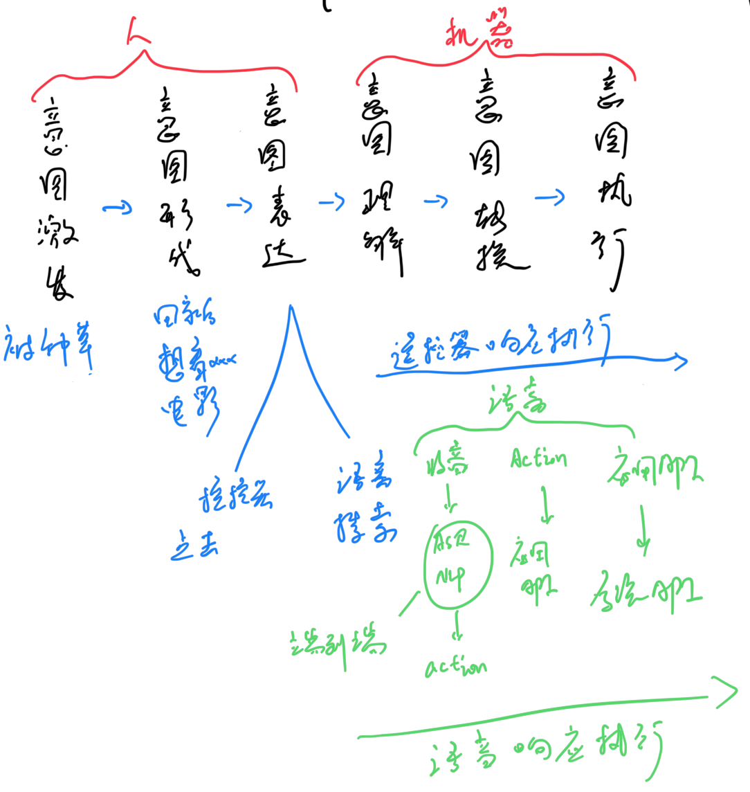

# 用户意图实现路径和大模型带来的变化

人实现意图的最终目标，是【想法】直接通过【外部代理】完全实现。当前社会有【代理人】的概念，即通过某个人来实现我们的想法。如果机器足够智能时，则【代理人】可以被【代理机器】替代，也就是机器也可以实现我们的想法。

从工具的角度来说，机器也是一种工具，而传统的工具是指辅助人类实现某种生产过程，如果工具足够智能，也可以升级为代理的角色，完全或部分替代人类的生产。当前我们所发明的大部分工具，是一种从生产方式转变为另一种生产方式，根本目的在于提高生产效率。

当工具完全替换人的劳动时，生产效率的提高，通过对工具的升级来实现，而升级工具则通过人来实现，因此人的生产工作转换为间接提供生产工具，而非直接参与生产。

按照如上的推导，工具实现的代理本质也是一种工具。人们在直接或间接参与生产时，都需要工具来实现，如果代理足够智能，那么人们的工作会集中在生产和维护代理上，而代理则直接参与生产。类似于在交通工具发明前，人们使用自己的双腿走路，交通工具发明后，则人们大部分情况会使用交通工具作为代理实现出行的目的。

类似的概念，人们在操作一项任务时，如果代理足够智能，那么人们就可以直接下达指令，实现自己的操作意图。本文主要研究在电视内容消费领域，用户的意图实现路径和大模型带来的变化。

### 1.用户的意图实现路径

用户意图实现可以分为6步。

 #### 1.1 意图激发
 

 
 
 #### 1.2 意图形成
  
 
 #### 1.3 意图表达
 
 
 #### 1.4 意图理解
 
 
 #### 1.5 意图转换
 
 
 #### 1.6 意图执行
 
 
### 2.大模型的用户意图实现路径变化

#### 2.1 意图理解部分

语音的历史实现方法：
1）用户通过关键词唤醒语音助手

2）用户唤醒语音助手后，继续输出语音表达意图
目前体验待改善点：
（1）唤醒后需要等待一段时间()再说识别的语音，否则语音助手无法识别意图。改善方向：已经在交谈中了，是不是不需要继续等唤醒，而是每句话都会进入识别意图？
（2）当前只能识别到可以转换为文字的语音信息，无法识别到非文本类的语音信息

3）设备在输出意图识别和执行的过程中，用户通过关键词打断本次意图的后续任务
目前体验待改善点：
（1）已经在交谈中了，是不是不需要通过唤醒来打断后，再进行识别意图？
（2）是否可以通过，“等一下”、“不对”、“等等”等进行意图中的打断，而不仅仅是唤醒词来打断？

4）设备语义理解模块对用户音频进行意图理解
 当前的设备使用云端或本地大模型进行用户音频理解，理解后转换为相应的action，分发到各个应用

5）各应用接收到语音发出的action后，映射转换为应用自有api

6）各应用自有api调用系统api，执行系统接口实现用户意图
 
 
 

